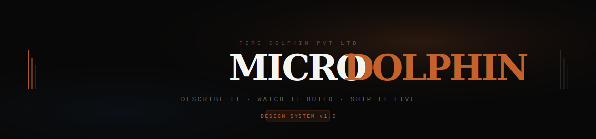

<div align="center">
  
</div>

<br/>

<div align="center">

[](https://microdolphin.com)&nbsp;&nbsp;[](https://microdolphin.com)&nbsp;&nbsp;[](https://microdolphin.com)&nbsp;&nbsp;[](https://microdolphin.com)

</div>

<br/>

MicroDolphin turns plain language into production-ready full-stack apps — deployed to real infrastructure, with a live URL, in under 60 seconds. Not a code dump. A running product.

<br/>

---

### What we build

&nbsp;&nbsp;**App generation engine** &nbsp;·&nbsp; Multi-agent pipeline that plans, writes, validates, and deploys — end to end.<br/>
&nbsp;&nbsp;**Live preview infrastructure** &nbsp;·&nbsp; Every project on real Kubernetes. Shareable URL before you finish reading the output.<br/>
&nbsp;&nbsp;**Context memory** &nbsp;·&nbsp; RAG over your full project history. The AI remembers what you built two weeks ago.<br/>
&nbsp;&nbsp;**GitHub sync** &nbsp;·&nbsp; One click. Full commit history. No lock-in. Your code stays yours.

---

### Repositories

| | Repo | Description |
|---|---|---|
| 🔒 | `microdolphin` | Core generation engine & agent pipeline |
| 🔒 | `microdolphin-preview` | Live preview infra & container orchestration |
| 🔒 | `microdolphin-ui` | Design system, brand, components |
| 🔜 | `microdolphin-sdk` | TypeScript SDK |
| 🔜 | `microdolphin-docs` | Public documentation |

---

### Design system

```
Accent      #c4622d — Ember. One per context. Never more than one.
Background  #080808 — Void. Dark-first, always.
Fonts       Archivo (display) · Geist Sans (body) · Geist Mono (data)
Radius      20px cards · 12px UI elements
Spacing     8pt grid — every value a multiple of 8
Glass       rgba(255,255,255, ≤0.08) · blur 24px
```

---

### Security

Found a vulnerability? Email **[security@microdolphin.com](mailto:security@microdolphin.com)** — do not open a public issue. We acknowledge within 48 hours.

---

<div align="center">

[microdolphin.com](https://microdolphin.com) &nbsp;·&nbsp; [docs](https://docs.microdolphin.com) &nbsp;·&nbsp; [status](https://status.microdolphin.com) &nbsp;·&nbsp; [discord](https://discord.gg/microdolphin)

<sub>Build fast · Ship live · Iterate without limits &nbsp;—&nbsp; Fire Dolphin Pvt Ltd</sub>

</div>