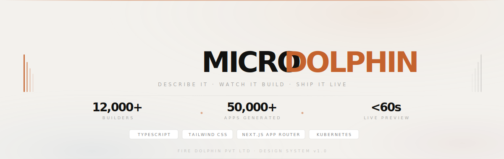

<div align="center">



<br/>

[](https://microdolphin.com)&nbsp;
[](https://discord.gg/microdolphin)&nbsp;
[](https://docs.microdolphin.com)&nbsp;
[](https://status.microdolphin.com)

</div>

<br/>

---

<br/>

## ▸ Overview

MicroDolphin turns your words into production-ready full-stack apps — complete with live previews on real infrastructure, GitHub sync, and the ability to iterate in seconds, not days.

A full-stack engineer. On demand. Yours.

- **▸** Multi-agent pipeline — intake, planning, generation, QA, deploy
- **▸** Every project gets its own live URL on real Kubernetes infrastructure — not a sandbox, not a simulation
- **▸** Semantic search over your entire codebase — the AI remembers every file, every conversation, every iteration
- **▸** Push to GitHub with one click — full commit history, no vendor lock-in

<br/>

---

<br/>

## ▸ How It Works

```
01  Describe    Type what you want in plain language. Vague or specific — agents adapt.
02  Build       Seven specialized agents run in parallel: intake, plan, write, QA, ship.
03  Preview     Live URL on real infra — ready before generation even finishes.
04  Iterate     Describe a change. Preview updates instantly. No redeployment needed.
05  Ship        Export to GitHub or share your live link. You're already done.
```

<br/>

---

<br/>

## ▸ Design System

### Color Palette — Dark-First · 60-30-10 Rule

| Token | Value | Name | Usage |
|:--|:--|:--|:--|
| `--bg` | `#080808` | Void | Base background — 60% |
| `--surface` | `rgba(255,255,255,0.045)` | Glass | Cards, panels — 30% |
| `--surface-h` | `rgba(255,255,255,0.075)` | Glass Hover | Card hover state |
| `--txt` | `#f4f4f1` | White | Primary text |
| `--txt-2` | `rgba(244,244,241,0.55)` | White 55 | Secondary text |
| `--txt-3` | `rgba(244,244,241,0.28)` | White 28 | Labels, muted text |
| `--accent` | `#c4622d` | Ember | CTAs, accents — 10% |
| `--accent2` | `#2d5fa0` | Ocean | Trust, orbs only |
| — | `#7a1f2e` | Maroon | Premium orbs only |
| `--border` | `rgba(255,255,255,0.08)` | Border | Default borders |
| `--border-h` | `rgba(255,255,255,0.18)` | Border Hover | Hover borders |
| `--shimmer` | `rgba(255,255,255,0.13)` | Shimmer | Top card highlight |

> One accent per context. Orange = CTA · Blue = Trust · Maroon = Premium

**Light Theme overrides:** bg `#f3f1ed` (Cream) · surface `#ffffff` · text `#111110` · Ember `#c4622d` unchanged

<br/>

### Typography

| Role | Font | Weights |
|:--|:--|:--|
| Display / Headings | **Archivo** | 700 · 800 · 900 · 900 Italic |
| Body / Paragraphs | **Geist Sans** | 400 · 500 · 700 |
| Labels / Data / Code | **Geist Mono** | 400 |

**Type Scale — Major Third (1.25×)**

| Token | REM | PX | Usage |
|:--|:--|:--|:--|
| `--t-xs` | 0.64rem | ~10px | Labels, badges, buttons, nav links |
| `--t-sm` | 0.80rem | ~13px | Body text, card descriptions |
| `--t-base` | 1.00rem | 16px | Default body, section subtitles |
| `--t-md` | 1.25rem | 20px | Pillar h3, feature headings |
| `--t-lg` | 1.563rem | 25px | Section headings |
| `--t-xl` | 1.953rem | 31px | Tagline, mini stat values |
| `--t-2xl` | 2.441rem | ~39px | Stat numbers |
| `--t-3xl` | 3.052rem | ~49px | CTA heading |
| `--t-4xl` | 3.815rem | ~61px | Hero h1, type display |

**Letter Spacing Rules**

```
4xl display   →  -0.055em
3xl display   →  -0.042em
lg heading    →  -0.030em
md heading    →  -0.020em
.label class  →  +0.340em  UPPERCASE
nav links     →  +0.220em  UPPERCASE
buttons       →  +0.160em  UPPERCASE
body          →  default (0)
```

**Line Height Rules**

```
Hero display  →  0.90  (very tight)
CTA heading   →  1.00
UI headings   →  1.15 – 1.20
Tagline       →  1.17
Body text     →  1.65 – 1.72
Stat numbers  →  1.00
Labels        →  1.00
```

<br/>

### Spacing — 8pt Grid

Every value must be a multiple of 8. Never use values outside this list.

| Token | REM | PX | Usage |
|:--|:--|:--|:--|
| `--s1` | 0.5rem | 8px | Tiny gaps, dot indicators, mini margins |
| `--s2` | 1rem | 16px | Nav padding Y, pill gaps, small margins |
| `--s3` | 1.5rem | 24px | Button padding, eyebrow margin |
| `--s4` | 2rem | 32px | Card padding default, pillar padding |
| `--s5` | 2.5rem | 40px | Card padding large, nav pad X |
| `--s6` | 3rem | 48px | Hero card padding, CTA vertical |
| `--s8` | 4rem | 64px | CTA horizontal, marquee gaps |
| `--s12` | 6rem | 96px | Section padding Y (desktop) |

<br/>

### Glass Recipe

```
background    rgba(255,255,255, 0.04)   ← max 0.08, never exceed
border        rgba(255,255,255, 0.08)
blur          backdrop-filter: blur(24px)
highlight     rgba(255,255,255, 0.12)   ← top shimmer, dark only
radius        20px
```

<br/>

### Layout & Grid

```
Max width     1280px   centered, auto margins
Card gap      10px     between all bento cells
Card radius   20px     all cards  ·  12px small/FAQ
Page sides    32px     left + right padding
Section Y     96px     top + bottom per section
Figma grid    12 col   10px gutter  ·  32px margin  ·  8px nudge
```

**Bento Grid — 7 Rows**

```
R1  1fr + 300px          h: 440px   Hero + Logo
R2  192px + 1fr + 192px  h: 152px   Stat + Tagline + Stat
R3  repeat(4, 1fr)       h: 268px   Four pillars
R4  1fr + 352px          h: 320px   Colors + Glass recipe
R5  1fr + 1fr            h: 308px   Typography + Rules
R6  1fr                  h: 216px   CTA banner
R7  1fr + 240px + 240px  h: 172px   Marquee + Mini + Mini
```

<br/>

### Design Pillars

```
01  Segmented      Built from repeating bar units. Never organic.
                   Structure from accumulation.

02  Systematic     Decisions are rules. Spacing, color, type —
                   strict scale, always.

03  Translucent    Glass layers over depth. Light passes through.
                   Surfaces breathe.

04  Negative Space The dolphin lives in the gap.
                   Silence is part of the language.
```

<br/>

### Do & Don't

```
✓  Use 8pt spacing — all values multiples of 8
✗  Round cards beyond 20px — kills the engineered feel
✓  Echo bar motifs in dividers and data visualizations
✗  Mix accent colors — one per page context only
✓  Let negative space breathe — generously
```

<br/>

---

<br/>

## ▸ Pricing

| Plan | Price | Apps | Projects | |
|:--|:--|:--|:--|:--|
| **Free** | $0 / mo | 5 / day | 2 active | Live preview · GitHub export · Community support |
| **Pro** | $20 / mo | 50 / day | 10 active | Priority queue · Faster model · Email support |
| **Team** | $99 / mo | Unlimited | Unlimited | SSO · SAML · RBAC · Custom models · SLA |

All plans include live preview infrastructure, real-time streaming, and full GitHub integration.

<br/>

---

<br/>

## ▸ Security

- **▸** Every generated app runs in isolated containers
- **▸** SSO, SAML, RBAC — Team plan
- **▸** ISO 27001-aligned security practices across all infrastructure
- **▸** Your code is never used for model training or shared with third parties

**Found a vulnerability?** Email [tech@microdolphin.com](mailto:tech@microdolphin.com) — do not open a public issue. We acknowledge within 48 hours.

<br/>

---

<br/>

## ▸ Team

| | Name | Role | Contact |
|:--|:--|:--|:--|
| ◆ | **Abhay Krishnan N** | Founder | [founder@microdolphin.com](mailto:founder@microdolphin.com) |
| ◆ | **Aditya Nalavade** | Tech | [tech@microdolphin.com](mailto:tech@microdolphin.com) |
| ◆ | **Nirav Thakur** | Design | [design@microdolphin.com](mailto:design@microdolphin.com) |

<br/>

---

<br/>

## ▸ Links

| | |
|:--|:--|
| **Website** | [microdolphin.com](https://microdolphin.com) |
| **Discord** | [discord.gg/microdolphin](https://discord.gg/microdolphin) |
| **Docs** | [docs.microdolphin.com](https://docs.microdolphin.com) |
| **Status** | [status.microdolphin.com](https://status.microdolphin.com) |
| **Blog** | [microdolphin.com/blog](https://microdolphin.com/blog) |
| **Careers** | [microdolphin.com/careers](https://microdolphin.com/careers) |
| **Help Center** | [microdolphin.com/help](https://microdolphin.com/help) |
| **Privacy** | [microdolphin.com/privacy](https://microdolphin.com/privacy) |
| **Terms** | [microdolphin.com/terms](https://microdolphin.com/terms) |

<br/>

---

<div align="center">
<br/>

<br/><br/>
<sub><code>SEGMENTED · SYSTEMATIC · GLASSMORPHIC</code></sub>
<br/>
<sub>Build fast · Ship live · Iterate without limits — Fire Dolphin Pvt Ltd</sub>
<br/><br/>
</div>