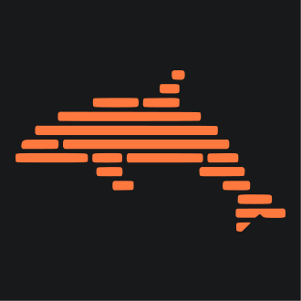

<div align="center">

<br/>



<br/><br/>

# MicroDolphin

**Describe it. Watch it build. Ship it live.**

<br/>


<br/><br/>

[](https://microdolphin.com)&nbsp;
[](https://discord.gg/microdolphin)&nbsp;
[](https://microdolphin.com)

<br/>

*by Fire Dolphin Pvt Ltd*

</div>

<br/>

---

<br/>

## ▸ Overview

MicroDolphin turns your words into production-ready full-stack apps — complete with live previews on real infrastructure, GitHub sync, and the ability to iterate in seconds, not days.

A full-stack engineer. On demand. Yours.

<br/>

---

<br/>

## ▸ What We Build

### Real infrastructure. Not a sandbox.
Every project gets its own live URL on real Kubernetes-managed infrastructure. Not a code snippet. Not a simulated preview. A real, running application — accessible from anywhere, instantly.

### Seven agents. One seamless pipeline.
From your first prompt to a deployed app, a coordinated pipeline of specialized agents handles intake, planning, execution, quality checks, and publishing — all in one automated pipeline.

### It gets smarter as you go.
MicroDolphin remembers your entire project — every file, every conversation, every iteration — using semantic search over your codebase. The more you build, the better it understands what you're making.

<br/>

---

<br/>

## ▸ How It Works

```
01  Describe    Type what you want to build in plain language.
02  Build       Agents stream code to your screen in real time.
                Your live preview URL is ready before generation finishes.
03  Ship        Describe changes, preview updates instantly.
                Export to GitHub or share your live link directly.
```

<br/>

---

<br/>

## ▸ Pricing

| Plan | Price | Limit |
|:--|:--|:--|
| **Free** | $0 / month | 5 apps/day · 2 active projects |
| **Pro** | $20 / month | 50 apps/day · 10 active projects |
| **Team** | $99 / month | Unlimited · SSO · SAML · RBAC · SLA |

All plans include live preview infrastructure, real-time streaming, and full GitHub integration.

<br/>

---

<br/>

## ▸ Security

- **▸** Every generated app runs in isolated containers
- **▸** SSO, SAML, RBAC — Team plan
- **▸** ISO 27001-aligned security practices
- **▸** Your code is never shared with third parties or used for model training

**Found a vulnerability?** Email [tech@microdolphin.com](mailto:tech@microdolphin.com) — do not open a public issue.

<br/>

---

<br/>

## ▸ Team

| | Name | Role | Contact |
|:--|:--|:--|:--|
| ◆ | **Abhay Krishnan N** | Founder | [founder@microdolphin.com](mailto:founder@microdolphin.com) |
| ◆ | **Aditya Nalavade** | Tech | [tech@microdolphin.com](mailto:tech@microdolphin.com) |
| ◆ | **Nirav Thakur** | Design | [design@microdolphin.com](mailto:design@microdolphin.com) |

<br/>

---

<br/>

## ▸ Links

| | |
|:--|:--|
| **Website** | [microdolphin.com](https://microdolphin.com) |
| **Discord** | [discord.gg/microdolphin](https://discord.gg/microdolphin) |
| **Blog** | [microdolphin.com/blog](https://microdolphin.com/blog) |
| **Careers** | [microdolphin.com/careers](https://microdolphin.com/careers) |
| **Help Center** | [microdolphin.com/help](https://microdolphin.com/help) |
| **Privacy Policy** | [microdolphin.com/privacy](https://microdolphin.com/privacy) |
| **Terms of Service** | [microdolphin.com/terms](https://microdolphin.com/terms) |

<br/>

---

<div align="center">
<br/>

<br/><br/>
<sub>Build fast · Ship live · Iterate without limits — Fire Dolphin Pvt Ltd</sub>
<br/><br/>
</div>